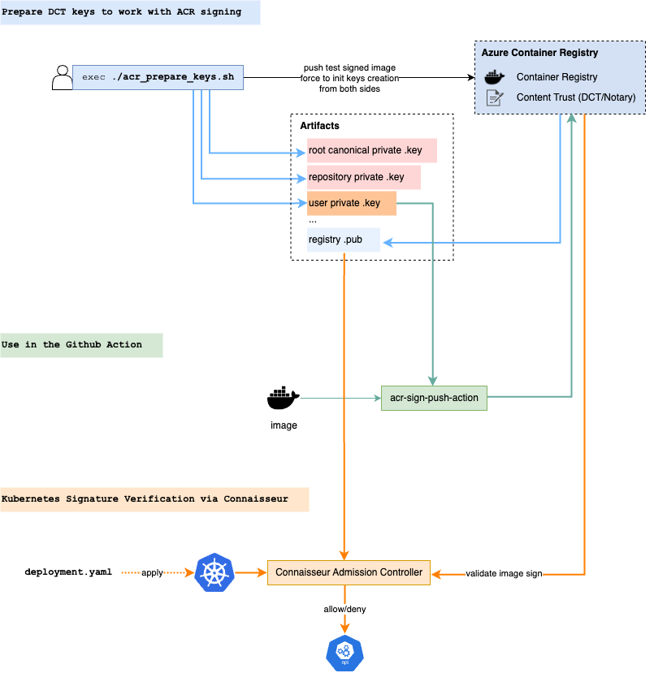

# Azure Container Registry (ACR) with Content Trust. Documentation, Helpers and sign/push GHA action

## Features:
  * based on `docker trust` cli functionality (without notary/notation utils)
  * for `Azure Container Registry` Content Trust (DCT/Notary)

## Topics:
  * [How to prepare DCT keys to work with ACR signing](./docs/prepare_keys.md)
  * [How to use the `acr-sign-push-action`](./docs/action_usage.md)
  * [Setup Kubernetes Signature Verification via Connaisseur Admission Controller](./docs/k8s_connaisseur.md)

## Helpers:
  * [Helper script to init and create all necessary keys for ACR/DCT signing](/hacks/acr_prepare_keys.sh) (please read "[How to prepare DCT keys](./docs/prepare_keys.md)" article before)

## Flow
[draw.io source](./docs/acr-dct.drawio)
